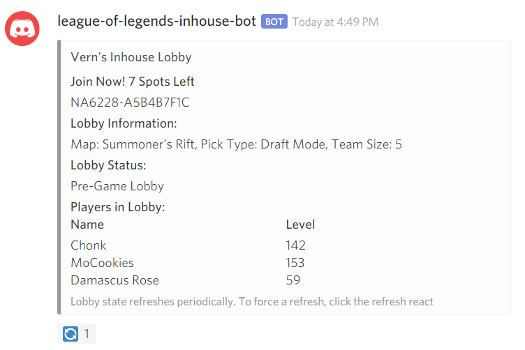

# League of Legends Inhouse Organizer Discord Bot

A Discord bot that generates tournament codes for use in the league client to organize inhouse lobbies and 
automatically track the lobby status in real time. Not deployable as riot tournament api policy does not
support creating single games, but is ready to go if this policy changes or new API for customs is introduced. 
 
Written in TypeScript and discord.js library

## Features
* Generates tournament code allowing one-click join a common lobby
* Tracks who is currently in lobby automatically using Lobby Events API
* Customize lobby options:
    1) Map (summoners rift / howling abyss)
    2) Team Size
    3) Pick Type (blind/draft/all random/tournament draft)
    4) Spectator Type (all/lobby only/none)
* Optimal rate-limiting on combined application and method basis using token bucket algorithm
* Built in Summoner caching

## Sample Bot Usage
### Create 5v5 tournament draft game
```
!lol-inhouse new picktype=tournamentdraft
```

### Create 5v5 aram
```
!lol-inhouse new map=howlingabyss picktype=random
```

### Create a 4v4 blind pick on howling abyss with no spectators allowed
``` 
!lol-inhouse new teamsize=4 map=howlingabyss picktype=blind spectatortype=none
```

### Sample Screenshot


## Building

### openapi-generator
This bot uses https://github.com/OpenAPITools/openapi-generator and a openapi-v3 spec to 
generate the http client for interfacing with the Riot API. To build this bot, install
the openapi-generator cli. 

Run the generator from the project root directory
```
 openapi-generator-cli generate -g typescript-rxjs -i openapi-specification.yaml -o generated
```

### npm
Install dependencies from npm
```
npm install
```

### run
Edit `Config.ts` with Discord and Riot API Keys, and the base path to riot URL.
Optionally set log level in this file as well.

Then,
```
npm start
```

or

``` 
tsc
node dist/src/main.js
```

## Testing
Testing without a tournament api capable key can be done with https://github.com/artemigkh/lol-tournament-testing-proxy,
a reverse proxy that mocks tournament api calls and proxies everything else to the real riot api
